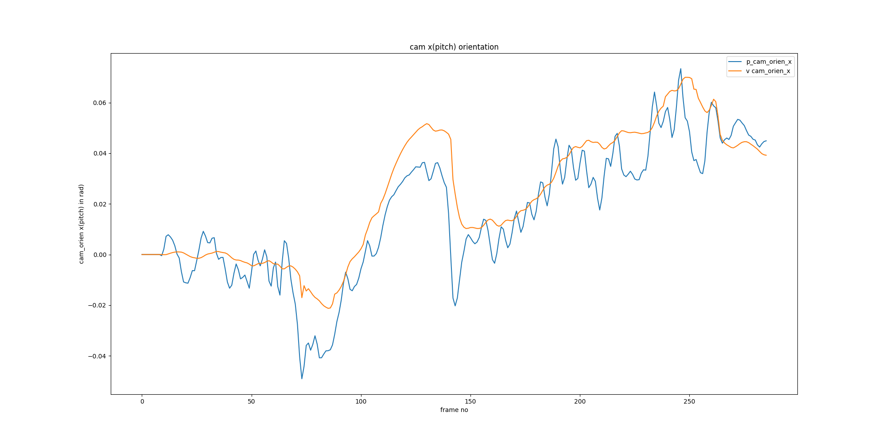
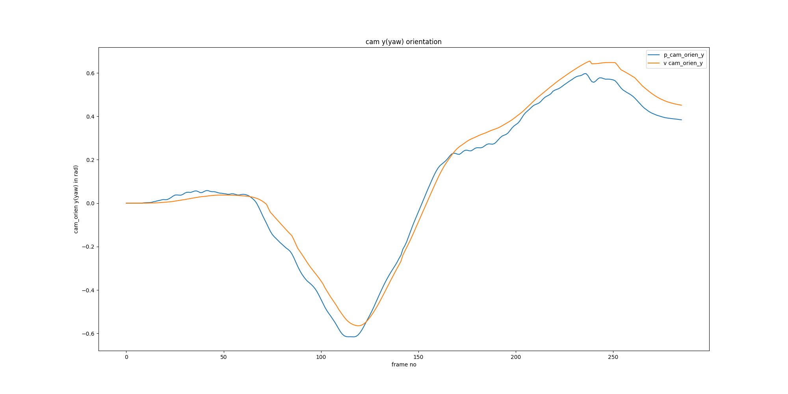
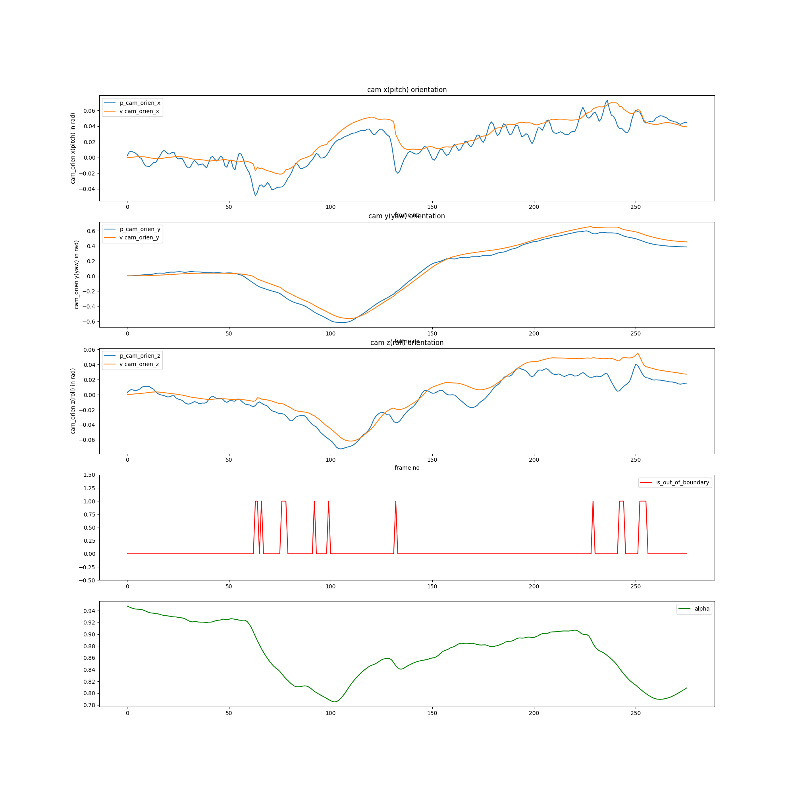

# Video Stabilization in Python

This repo is to simulate the video stabilization function in python version. 

### code layout

```
├── config_path.py   # config files path
├── eis_core    # eis_lib
│   ├── eis_core_config_loader.py # config loader
│   ├── eis_core_pass1.py         # eis pass1
│   ├── eis_core_pass2.py         # eis pass2
│   ├── eis_core_quat.py          # quaternion operation
│   ├── eis_core_queue_handler.py # queue handler  
│   ├── eis_core_type.py          # data type
├── readme.md
├── run_analysis.sh
├── run_vid_stab.py               # main 
├── run_vid_stab.sh
└── sig_gen
    └── sig_gen.py                # signal generator

```

**usage:**

```
python run_vid_stab.py log_dir_path
```

eis logs are in _log_dir_path_, which includes:

- eis_log/imu.log
- eis_log/cs.log
- xxx.mp4

imu.log are gyro logs which formats is :

```
23791083810 -0.03964500 -0.03088870 0.02203540
23791179050 29.56160000 13.00250000 3.39157000
23791202609 29.56160000 13.00250000 3.39157000
23791226168 29.56160000 13.00250000 3.39157000
23791249727 29.56160000 13.00250000 3.39157000
23791274247 0.00311556 -0.02844530 0.02325710
23791298772 0.00433728 -0.02722360 0.02081360
23791323296 0.00311556 -0.02600180 0.02203540
23791347821 0.00067210 -0.02355840 0.02325710
23791372348 -0.00299309 -0.02233660 0.02692230

```

cs.log is video meta data:

```
23805625344 100000
23805958592 100000
23806291840 100000
23806625088 100000
23806958335 100000
23807291584 100000
23807624832 100000
23807958080 100000
23808291328 100000
23808624576 100000

```

#### run sensor simulator


The sensor simulator read video and gyro log with timestamps, and output sensor signal in time sequence order, the gyro samples push into the buffer.

the refine the signal generation config for the gyro axis order and timestamp scale, for example,
_time_scale_exp : 7_ , means timestamp/10^7 in sec

siggen_config.json

```
{
    "gyro_log_idx": [0,1,2,3],
    "gyro_time_scale_exp": 7,
    "cmos_time_scale_exp": 7
    
}
```

the simulator runs like: 
```
top blanking = 178
frame_rate = 30.000000
frame_duration = 0.033333
line_duration = 0.000023
rs_time = 0.025067
================================
focal length = 1418.218085
================================
out_dist = 135.000000
load cmos log....
load gyro log....
cmos signal frame_count = 1
cmos signal frame_count = 2
=============================================================
frame_count = 0
start of frame: vs = 4529436513, exp = 100000
[gyro buffer snapshot]:
----------------------------------------------------------
ts = 452.974844, gx = 0.028592, gy = -0.006553, gz = -0.042501
ts = 452.972440, gx = 0.031036, gy = -0.008996, gz = -0.040057
ts = 452.970035, gx = 0.034701, gy = -0.008996, gz = -0.038836
ts = 452.967629, gx = 0.038366, gy = -0.011440, gz = -0.036392
ts = 452.965224, gx = 0.038366, gy = -0.011440, gz = -0.037614
ts = 452.962821, gx = 0.040809, gy = -0.011440, gz = -0.036392
ts = 452.960416, gx = 0.042031, gy = -0.013883, gz = -0.036392
ts = 452.958010, gx = 0.039588, gy = -0.013883, gz = -0.036392
ts = 452.955606, gx = 0.035922, gy = -0.017548, gz = -0.037614
ts = 452.953202, gx = 0.028592, gy = -0.016327, gz = -0.037614
ts = 452.950797, gx = 0.021262, gy = -0.016327, gz = -0.037614
ts = 452.948391, gx = 0.013931, gy = -0.016327, gz = -0.037614
ts = 452.945987, gx = 0.004157, gy = -0.012661, gz = -0.040057
ts = 452.943583, gx = -0.001951, gy = -0.012661, gz = -0.041279
ts = 452.941178, gx = -0.011725, gy = -0.008996, gz = -0.041279
ts = 452.938773, gx = -0.017834, gy = -0.002888, gz = -0.040057
ts = 452.936368, gx = -0.021499, gy = 0.000778, gz = -0.040057
ts = 452.933964, gx = -0.022721, gy = 0.003221, gz = -0.038836
ts = 452.931559, gx = -0.023942, gy = 0.010551, gz = -0.040057
ts = 452.929153, gx = -0.023942, gy = 0.016660, gz = -0.040057
ts = 452.926749, gx = -0.021499, gy = 0.017882, gz = -0.040057
ts = 452.924345, gx = -0.016612, gy = 0.023990, gz = -0.041279
ts = 452.921940, gx = -0.015390, gy = 0.026434, gz = -0.041279
ts = 452.919535, gx = -0.014168, gy = 0.027656, gz = -0.040057
ts = 452.917130, gx = -0.009282, gy = 0.030099, gz = -0.040057
ts = 452.914726, gx = -0.006838, gy = 0.028877, gz = -0.040057
ts = 452.912321, gx = -0.004395, gy = 0.028877, gz = -0.037614
ts = 452.909916, gx = 0.000492, gy = 0.028877, gz = -0.037614
ts = 452.907511, gx = 0.002936, gy = 0.031321, gz = -0.037614
ts = 452.905107, gx = 0.006601, gy = 0.027656, gz = -0.037614
----------------------------------------------------------
cmos signal frame_count = 3
=============================================================
frame_count = 1
start of frame: vs = 4529769760, exp = 100000
[gyro buffer snapshot]:
----------------------------------------------------------
ts = 453.008511, gx = 0.006601, gy = 0.030099, gz = -0.049831
ts = 453.006105, gx = 0.009044, gy = 0.028877, gz = -0.051053
ts = 453.003700, gx = 0.013931, gy = 0.027656, gz = -0.053496
ts = 453.001296, gx = 0.013931, gy = 0.023990, gz = -0.052275
ts = 452.998892, gx = 0.017597, gy = 0.021547, gz = -0.054718
ts = 452.996486, gx = 0.018818, gy = 0.020325, gz = -0.052275
ts = 452.994081, gx = 0.021262, gy = 0.019104, gz = -0.051053
ts = 452.991677, gx = 0.021262, gy = 0.015438, gz = -0.051053
ts = 452.989273, gx = 0.022483, gy = 0.014217, gz = -0.049831
ts = 452.986867, gx = 0.022483, gy = 0.009330, gz = -0.049831
ts = 452.984463, gx = 0.023705, gy = 0.004443, gz = -0.048609
ts = 452.982058, gx = 0.021262, gy = 0.001999, gz = -0.046166
ts = 452.979654, gx = 0.024927, gy = -0.001666, gz = -0.046166
ts = 452.977248, gx = 0.024927, gy = -0.004109, gz = -0.043722
ts = 452.974844, gx = 0.028592, gy = -0.006553, gz = -0.042501
ts = 452.972440, gx = 0.031036, gy = -0.008996, gz = -0.040057
ts = 452.970035, gx = 0.034701, gy = -0.008996, gz = -0.038836
ts = 452.967629, gx = 0.038366, gy = -0.011440, gz = -0.036392
ts = 452.965224, gx = 0.038366, gy = -0.011440, gz = -0.037614
ts = 452.962821, gx = 0.040809, gy = -0.011440, gz = -0.036392
ts = 452.960416, gx = 0.042031, gy = -0.013883, gz = -0.036392
ts = 452.958010, gx = 0.039588, gy = -0.013883, gz = -0.036392
ts = 452.955606, gx = 0.035922, gy = -0.017548, gz = -0.037614
ts = 452.953202, gx = 0.028592, gy = -0.016327, gz = -0.037614
ts = 452.950797, gx = 0.021262, gy = -0.016327, gz = -0.037614
ts = 452.948391, gx = 0.013931, gy = -0.016327, gz = -0.037614
ts = 452.945987, gx = 0.004157, gy = -0.012661, gz = -0.040057
ts = 452.943583, gx = -0.001951, gy = -0.012661, gz = -0.041279
ts = 452.941178, gx = -0.011725, gy = -0.008996, gz = -0.041279
ts = 452.938773, gx = -0.017834, gy = -0.002888, gz = -0.040057
----------------------------------------------------------
prev_frame_ts = 452.942776, current_frame_ts = 452.976109, dt = 0.033333
first_line_ts = 452.976109, last_line_ts = 453.001176
now is outer moving region
v_cam_orientation x/y/z: 0.000000, 0.000000, 0.000000
p_cam_orientation x/y/z: 0.000000, 0.000000, 0.000000
is_out_of_boundary = 0
uncompensated_dist = 0.000000
alpha = 0.000000
cmos signal frame_count = 4
=============================================================

```

### analysis

you can run the vid_stab simulation and analysis the result by

`./run_vid_stab.sh log_dir`

the log `vid_stab.log` will be record in log_dir, and the analysis figures are:

**boundary control analysis**


**camera x-axis orientation**


**camera y-axis orientation**


**camera z-axis orientation**


**path analysis**


### result

the result directory is in log_dir and the naming is based on configuration setting, like:

`result_nonlinear_alpha_min_0.75_max_0.95_beta_1.00_gamma_0.90_inner_ratio_0.0_lookahead_10_crop_ratio_0.1`

### configuration
the configuration path is set in config_path.py

```
# configuration directory
#config_file_dir = "../../config/hc2_config/"
config_file_dir = "../../config/iqoo3_config/"

#config file path
eis_config_path = config_file_dir + "eis_config.json"
cmos_config_path = config_file_dir + "cmos_sensor_config.json"
debug_config_path = config_file_dir + "debug_config.json"
gyro_config_path = config_file_dir + "gyro_sensor_config.json"
video_config_path = config_file_dir + "video_config.json" 
coord_trans_matrix_config_path = config_file_dir + "coord_trans_matrix.json"
siggen_config_path = config_file_dir + "siggen_config.json"

```


