# Development Guide of an EIS System

An Electronic Image Stabilization utilizes motion sensor, normally is gyroscope, to estimate device motion and compensate jitter to stabilize a video.  

Main components of an EIS system include:

- Sensors
  - CMOS sensor
  - motion sensor
- Sensor synchronization
- Queue handler
- Image/Video Stabilization algorithm


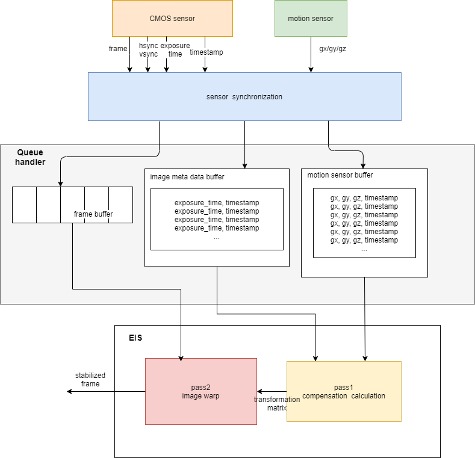


## The Requirements of an EIS system

To develop an EIS system, we would handle matters about sensor calibration and synchronization, since the EIS applies on a real-time system, a simulator is very important which can simulate a real-time system on device to mimic the EIS function which run on a device.  I write down some requirements and works which have to do in developing an EIS system according to my previous experience. 

### Sensor Calibration

For most MEMs Gyroscope sensors drift with bias, which accumulate errors by time. For those application of video stabilization, which apply low-pass filter to remove unwanted jitter from video, some weired drift would occur with uncalibrated gyro sensor.  The gyro sensor would calibrated both static and temperature bias. 

Here are some  technical articles about gyro bias calibration:

[Gyro Mechanical Performance: The Most Important Parameter](https://www.analog.com/media/en/technical-documentation/tech-articles/MS-2158.pdf)

[A SIMPLE CALIBRATION FOR MEMS GYROSCOPES](https://www.analog.com/media/en/technical-documentation/technical-articles/GyroCalibration_EDN_EU_7_2010.pdf)

### Video Meta Data

For a perfect EIS system which stabilized not only inter-frame motion (the motion between frame and frame) but also intra-frame motion(the motion during a frame). So that we require the time duration of time of adjacent frames generalized, and the the each time of the line which generalized  during a frame to compensate rolling shutter effect.

The required video meta data are:

- Focal length
- Exposure time
- CMOS blank time
- Vsync duration (frame rate)
- Hsync duration


**Focal length calculation:**

The focal length _in_ _pixel_ is for a camera intrinsic matrix,

$k = \begin{bmatrix}
f_x & s & x_0\\
0 & f_y & y_0\\0 & 0 & 1\end{bmatrix}$

- focal_length_x_in_pixel = (focal_mm / sensor_width_mm) * full_frame_width_in_pixel
-  focal_length_y_in_pixel = (focal_mm / sensor_height_mm) * full_frame_height_in_pixel

Calculation of  duration between frame-and-frame:

```
center_line_no = blanking + int(param.effective_height / 2)
prev_frame_center_ts = vsync_timestamp - (
    param.frame_height_in_pixel - center_line_no) * hsync_duration - prev_frame_exposure_time / 2
this_frame_center_ts = vsync_timestamp + vsync_duration - (
    param.frame_height_in_pixel - center_line_no) * hsync_duration - this_frame_exposure_time / 2
```

**CMOS blank time and Exposure time**

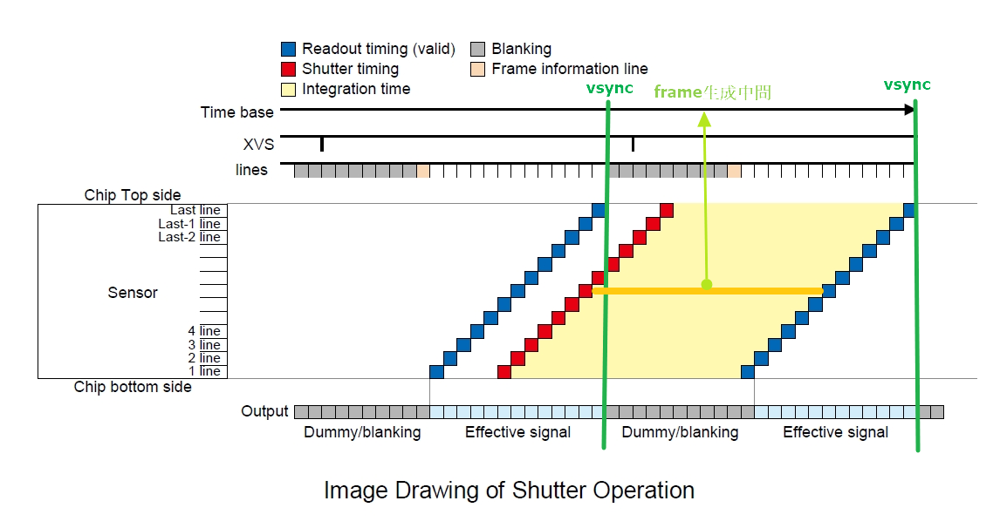

**Blank time measurement**

The number of blank line could be found in CMOS sensor specification, or the blank line duration could be measured by oscilloscope.

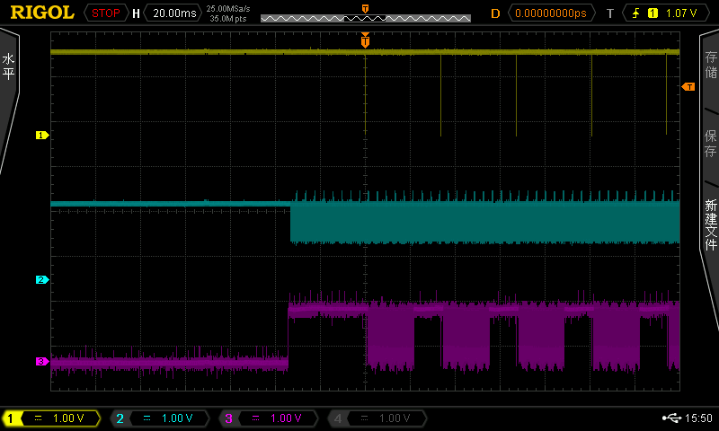

### Sensor Synchronization

An EIS system stabilizes video frames by eliminate jitter which calculated from gyroscope. There are two kind of sensors, CMOS and motion sensor, in an EIS system. The sensor synchronization is extremely strict for rolling shutter correction. Normally, there is no clock system in most motion sensor, however, for a CMOS sensor with Hsync and Vsync signal can be utilized to synchronized the time with gyroscope. 

There are some kind of sensor logs carefully designed for synchronization time with CMOS sensor:

**gyro log:**

The order from left to right of each column:

1. gyro sample timestamp (us)
2. current vsync timestamp  (us)
3. gyro  x-axis (degree/sec)
4. gyro y-axis (degree/sec)
5. gyro z-axis (degree/sec)
6. is this sample vsync signal or not
7. hsync  count number

 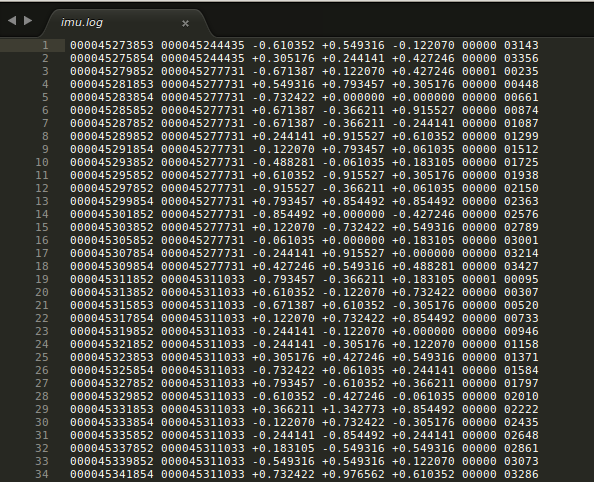

**CMOS log:**

The order from left to right of each column:

1. vsync timestamp (ns)

2. exposure time (ns)

 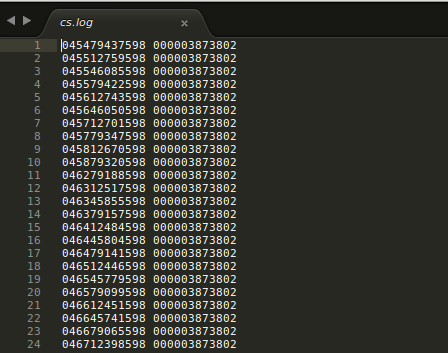


### Synchronization Validation

The synchronization validation is to verify the time alignment between the video frames and motion sensor. Test video and gyro sensor data are record in specific motion pattern  and frame pattern to easily estimate the motion in a frame. 

The motion pattern can be record by vibrator to generate some period sine wive motion which make pixels of frames moving in this kind period motion. 

Some sort of  image pattern are suitable for aligning the time between motion sensor and frame, like square or circle, a square pattern is much more easy to locate four corners and calculate the deformation from image. 

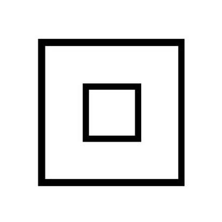

The input of the synchronization validation function are video with meta data and gyro data with timestamp. The output of the synchronization is time gap between video and gyro sensor. 

If the time gap is fixed from every test set, we can say that the time system of CMOS and gyro sensor are well alignment. 

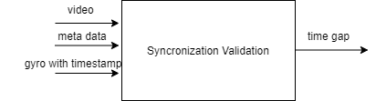

### Sensor Queue Handler

There are three queue buffer in an EIS system:

- video meta data buffer

  store Vsync timestamp and exposure time

- motion sensor buffer

  store gyro data with timestamp

- frame buffer

  store video frames 

The CMOS sensor pushes the video meta data and frame into _video meta data buffer_ and _frame buffer_. The gyro sensor pushes the gyro data with timestmap into _motion sensor buffer_. The video stabilization function pops these buffers data to generate an stabilized frame. The size of frame buffer and video meta data buffer are decided by the kernel size of the low-pass filter in the EIS system or by the number of frame of multi-frame denoise.  Normally , we buffer the two to three frame time duration gyro data into motion sensor buffer. For example, as a 30 fps  frame sample rate, and 500 samples/sec gyro sample rates, the motion sensor buffer with 3 frames duration is:

```
500 (samples/sec) /30 fps * 3 (frames buffer) = 50 
```

### Coordinate System 

For a gyroscope coordinate system, there is a mark point on the top, which is used to define the 3-axis coordinate, and angular rate is positive as rotate clockwise, negative vice versa. There would be a coordinate transformation from gyro sensor coordinate system to camera  coordinate system.

Here are an example of gyro sensor and camera coordinate system:

| gyro sensor  coordinate system                            | camera coordinate system          |
| --------------------------------------------------------- | --------------------------------- |
| 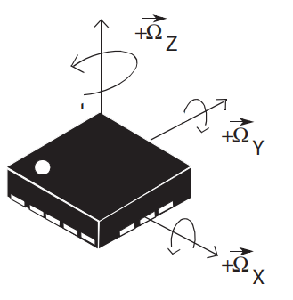 | 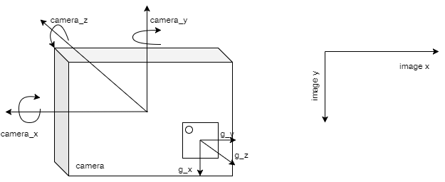 |

and the coordinate system transformation matrix from gyro to camera system:

$\begin{bmatrix}c_x \\ c_y\\ c_z\end{bmatrix} = \begin{bmatrix}
0 & -1 & 0\\
-1 & 0 & 0\\0 & 0 & -1\end{bmatrix}\begin{bmatrix}g_x\\g_y\\g_z\end{bmatrix}$

You can refer the gyroscope coordinate system from manufacture data sheet:

[L3GD20H MEMS motion sensor: three-axis digital output gyroscope](https://www.st.com/resource/en/datasheet/l3gd20h.pdf)

, and here is the android sensor coordinate system:

[Android Sensor Coordinate System](https://developer.android.com/guide/topics/sensors/sensors_overview#sensors-coords)

### Video Stabilization Function

- EIS pass 1: 

  motion estimation and jitter calculation

- EIS pass 2: 

  jitter compensation and image warp

There are normally two main steps in a video stabilization function. They can generally be called EIS pass 1 and pass 2 in EIS. In the first pass, device movement and trajectory are calculated from motion sensor or from frames. And smooth filter or some optimization is apply to the device trajectory, and get the motion vector from the difference between the smooth and real device trajectory. The compensated motion vector or transformation matrix will be the input of second pass.

EIS pass 2 do image warping to compensate the jitter by transformation matrix from EIS pass 1. The number of the transformation matrix used for compensation the jitter is based on how much frequency of the movement of the device. There are two main kind image warp method, grid and line-based:

| grid-based image warp          | line-based image warp          |
| ------------------------------ | ------------------------------ |
| 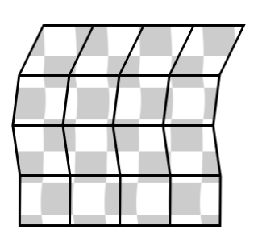 | 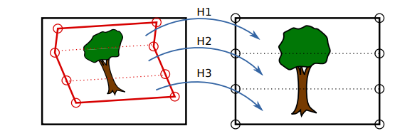 |

Here are some EIS methods suitable for mobile device application:

[Digital Video Stabilization and Rolling Shutter Correction using Gyroscopes](https://graphics.stanford.edu/papers/stabilization/karpenko_gyro.pdf)

[A Non-Linear Filter for Gyroscope-Based Video Stabilization](https://research.nvidia.com/sites/default/files/pubs/2014-09_A-Non-Linear-Filter/bell_troccoli_pulli_eccv2014.pdf)

### Performance Evaluation

The most common method to evaluate EIS performance is to compare stabilized video side-by-side from different devices. However, to have an objective method to evaluate how much level the video be stabilized, like have a stabilized score to compare the before and after stabilization level in the same video. 

There are some performance evaluation methods: 

- ==Stabilized score== before/after video stabilization

  the score to compare how much stabilized level between origin and stabilized video.

- Stabilization comparison between devices 
  - subjective evaluation 

    A equipment or a scheme can record two device stabilization video simultaneously.  The stabilized videos can be compared side-by-side.

  - objective evaluation

    - DxO
    
    - stabilized score
    
      compare stabilized score from  different device's videos which record in the same scene(in lab) 

### EIS System Simulator 

EIS algorithm applies in a real time system, so that we would like to have a simulator which can simulate the EIS function in a  device. The input of simulator is  an EIS dataset which includes, a video, video meta data log, and gyro log. The simulator would output these sensor signal from these logs sequentially by timestamps from these logs, which mimic the CMOS and gyro sensor output the signal samples. 

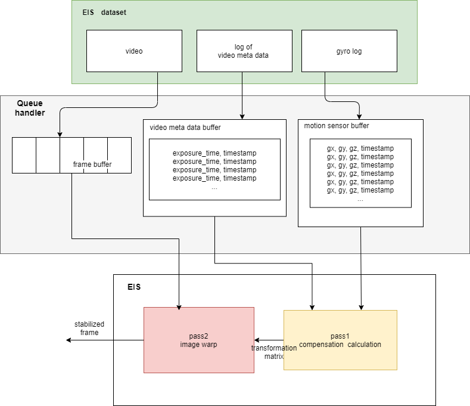

### Debug and Logger

The requirements of the logger of EIS system are:

- log with synchronized CMOS and gyro sensor

- as the input of an EIS simulator

- log on-line without drop signal

- used for debug on-line EIS function, which can record both stabilized video and origin video simultaneously. Besides recording stabilized video, we can record preview with origin video. 

  

