# Evaluation of Filter in Video Stabilization 

This evaluation is to quantify the filter design of video stabilization algorithm. We measure the qualify of the video stabilization result by two key features:

1. how much smooth  of a stabilized video(camera trajectory)
2. how much of the left margin to compensation

The camera trajectory utilized to analyze the smooth and the compensation condition. In a general video stabilization algorithm, there are two camera trajectory, physical camera trajectory and virtual camera trajectory, which represent real camera orientation and smooth camera orientation by low-pass filter. Following figure shows these two camera trajectory, the blue one _p_cam_orien_ is physical camera trajectory, the orange one _v_cam_orien_ is virtual camera trajectory.

The measurement is to evaluate the low-pass filter of video stabilization

```
virtaul_camera_trajectory =  lpf * physical_camera_trajectory
```

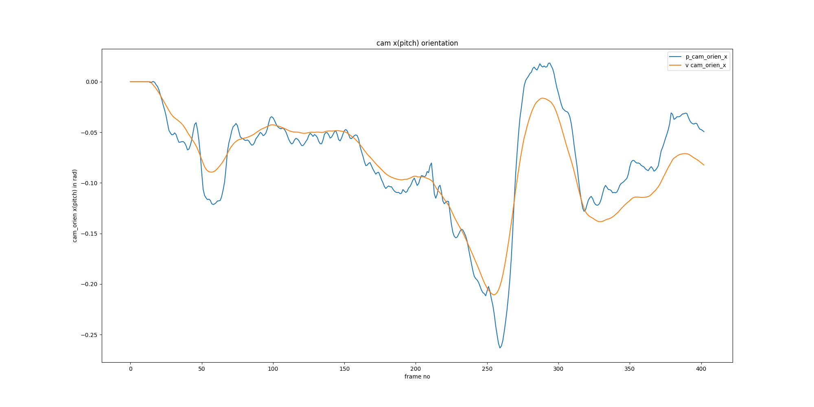

### Golden Camera Trajectory

For evaluation the quality of the filter design, we generate the golden camera trajectory to be the perfect camera trajectory, which is  the golden of the filter design. Assume the frequency of the video jitter is above $f\_c$ , the which is cutoff frequency of the low-pass filter utilized to generate the golden camera trajectory.

```
golden_lpf = low_pass_filter(cutoff=f_c)
golden_camera_trajectory = golden_lpf*physical_camera_trajectory 
```


The blue one is the golden camera trajectory, orange one the physical camera trajectory, and the green one is the virtual camera trajectory.

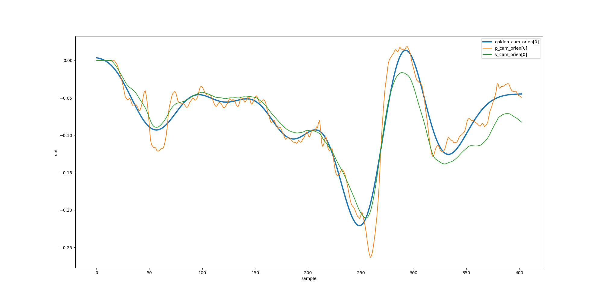 

### Score 1 : High Frequency Analysis

We use PSD (power spectrum Density) to analysis the frequency magnitude of camera trajectory. Python scipy function  calculate PSD of these camera motion.

PSD calculation : `scipy.signal.welch`

Here, we care about the camera motion instead of camera trajectory, due to the trajectory is the accumulation of the camera motion, which imply the low frequency. The target of this evaluation  to quantify the high frequency. 

```
frequency,cam_motion_psd = cal_psd(np.diff(cam_orien), sampling_frequency)
```

Here are PSD of physical camera, golden camera, virtual camera respectively. 

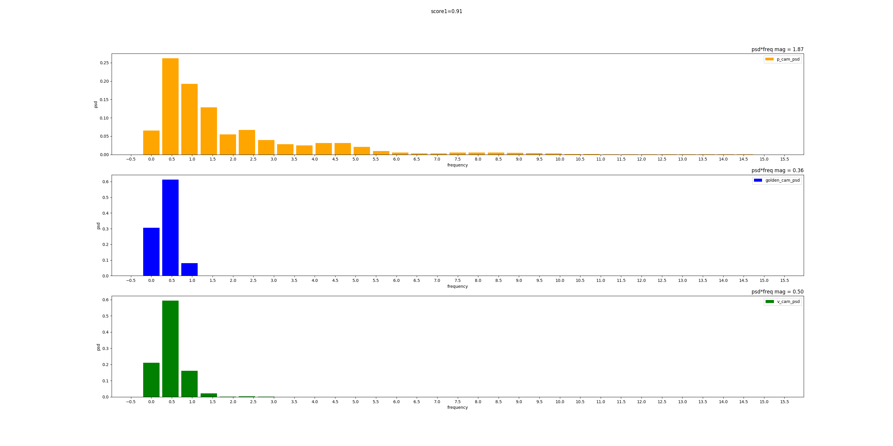

For quantify the high frequency magnitude, the high frequency magnitude calculated by:

```
high_frequency_mag = sum(freqency*cam_motino_psd)
```

and score 1 is to measure the high frequency compensation by video stabilization filter:

```
score1 = (p_cam_freq_mag-v_cam_freq_mag)/(p_cam_freq_mag-golden_cam_freq_mag)
```

**(p_cam_freq_mag - golden_cam_freq_mag)** means the total high frequency have to be compensated from physical camera.

**(p_cam_freq_mag - v_cam_freq_mag)** means the high frequency the algorithm filter compensated from physical camera.

### Score 2: Jitter Compensation Analysis

The compensated margin is very important method to measure the efficient of video stabilization filter design. As out of margin boundary the stabilization function have to paused to preserve the field of view of a video. For some filter design the latency occurs as IIR filter with large low-filter coefficient, it may cause a lot of out of boundary condition.

so the jitter considers from camera orientation:

```
total_jitter = |golden_cam_orien-p_cam_orien|
comp_jitter = |v_cam_orien- p_cam_orien|
```

the out-of-boundary condition occurs as 

```
comp_jitter > total_jitter
```

so that we calculate score 2 by:

```
jitter_ratio = total_jitter/(comp_jitter+0.0001)
if jitter_ratio[i]  > 1:
	jitter_ratio[i] = 1
score2 = mean(jitter_ratio)
```


### Summarize Score

The weight of score from score 1 and score 2 is set 0.6 and 0.4, I just care frequency more than out-of-boundary condition.

```
score = 0.6*score1 + 0.4*score2
```


### Experiment Result

We test the video stabilization algorithm which implemented from [A Non-Linear Filter for Gyroscope-Based Video Stabilization(https://research.nvidia.com/publication/non-linear-filter-gyroscope-based-video-stabilization)

There are five set parameters to test, here we would like to test the difference number of lookahead frames, from 0 to 20

|      | dataset:　vidhance logger／20200512_log08                    |
| ---- | ------------------------------------------------------------ |
| 1.   | result_nonlinear_<br />alpha_min_0.75_max_0.95_beta_1.00_gamma_0.95_inner_ratio_0.0_lookahead_0_crop_ratio_0.1 |
| 2.   | result_nonlinear_<br />alpha_min_0.75_max_0.95_beta_1.00_gamma_0.95_inner_ratio_0.0_lookahead_5_crop_ratio_0.1 |
| 3.   | result_nonlinear_<br />alpha_min_0.75_max_0.95_beta_1.00_gamma_0.95_inner_ratio_0.0_lookahead_10_crop_ratio_0.1 |
| 4.   | result_nonlinear_<br />alpha_min_0.75_max_0.95_beta_1.00_gamma_0.95_inner_ratio_0.0_lookahead_15_crop_ratio_0.1 |
| 5.   | result_nonlinear_<br />alpha_min_0.75_max_0.95_beta_1.00_gamma_0.95_inner_ratio_0.0_lookahead_20_crop_ratio_0.1 |

### Total Score Analysis

**alpha_min_0.75_max_0.95_beta_1.00_gamma_0.95_inner_ratio_0.0_lookahead_0_crop_ratio_0.1**

|            | score1 | score2 | score |
| ---------- | ------ | ------ | ----- |
| cam_axis_0 | 0.51   | 0.42   | 0.47  |
| cam_axis_1 | 0.52   | 0.54   | 0.53  |
| cam_axis_2 | 0.61   | 0.67   | 0.64  |
| avg_score  | 0.55   |        |       |

**alpha_min_0.75_max_0.95_beta_1.00_gamma_0.95_inner_ratio_0.0_lookahead_5_crop_ratio_0.1**

|            | score1 | score2 | score |
| ---------- | ------ | ------ | ----- |
| cam_axis_0 | 0.43   | 0.55   | 0.48  |
| cam_axis_1 | 0.78   | 0.63   | 0.72  |
| cam_axis_2 | 0.76   | 0.76   | 0.76  |
| avg_score  | 0.65   |        |       |

**alpha_min_0.75_max_0.95_beta_1.00_gamma_0.95_inner_ratio_0.0_lookahead_10_crop_ratio_0.1**

|            | score1 | score2 | score |
| ---------- | ------ | ------ | ----- |
| cam_axis_0 | 0.75   | 0.77   | 0.76  |
| cam_axis_1 | 0.85   | 0.67   | 0.78  |
| cam_axis_2 | 0.72   | 0.75   | 0.73  |
| avg_score  | 0.76   |        |       |

**alpha_min_0.75_max_0.95_beta_1.00_gamma_0.95_inner_ratio_0.0_lookahead_15_crop_ratio_0.1**

|            | score1 | score2 | score |
| ---------- | ------ | ------ | ----- |
| cam_axis_0 | 0.91   | 0.62   | 0.79  |
| cam_axis_1 | 0.94   | 0.77   | 0.87  |
| cam_axis_2 | 0.76   | 0.75   | 0.76  |
| avg_score  | 0.81   |        |       |

**alpha_min_0.75_max_0.95_beta_1.00_gamma_0.95_inner_ratio_0.0_lookahead_20_crop_ratio_0.1**

|            | score1 | score2 | score |
| ---------- | ------ | ------ | ----- |
| cam_axis_0 | 0.57   | 0.54   | 0.55  |
| cam_axis_1 | 0.91   | 0.72   | 0.83  |
| cam_axis_2 | 0.48   | 0.73   | 0.58  |
| avg_score  | 0.65   |        |       |

### Score 1: High Frequency Analysis

**alpha_min_0.75_max_0.95_beta_1.00_gamma_0.95_inner_ratio_0.0_lookahead_0_crop_ratio_0.1**

`score 1=0.51 ` 

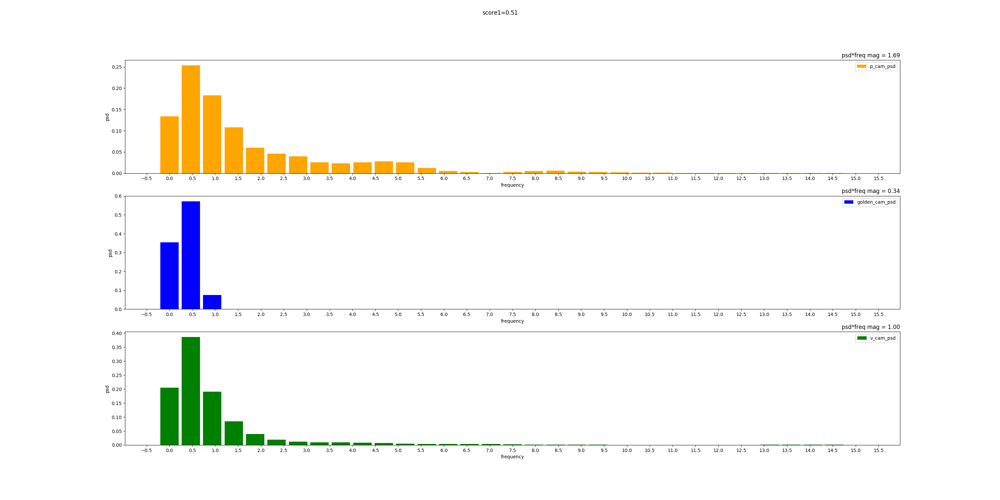

**alpha_min_0.75_max_0.95_beta_1.00_gamma_0.95_inner_ratio_0.0_lookahead_5_crop_ratio_0.1**

`score 1=0.43 ` 

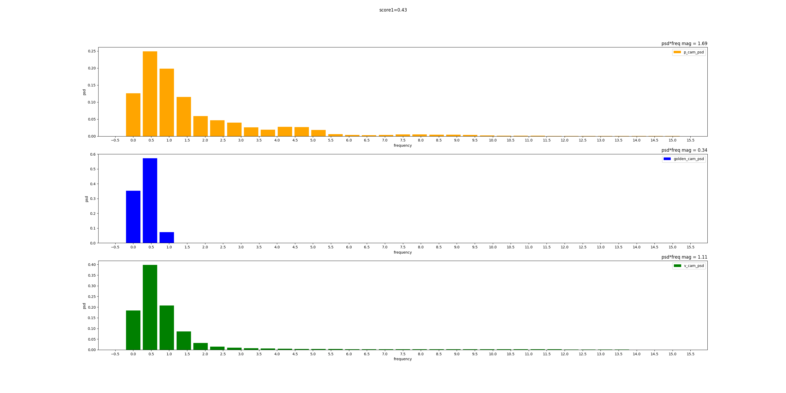

**alpha_min_0.75_max_0.95_beta_1.00_gamma_0.95_inner_ratio_0.0_lookahead_10_crop_ratio_0.1**

`score 1=0.75` 

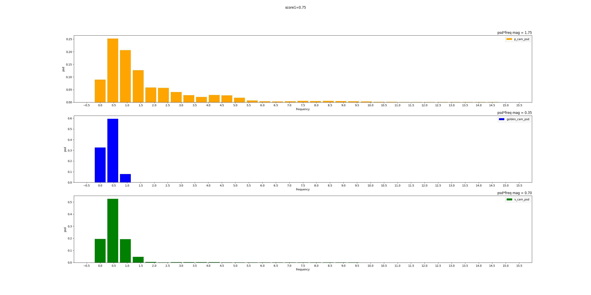

**alpha_min_0.75_max_0.95_beta_1.00_gamma_0.95_inner_ratio_0.0_lookahead_15_crop_ratio_0.1**

`score 1=0.91 ` 


**alpha_min_0.75_max_0.95_beta_1.00_gamma_0.95_inner_ratio_0.0_lookahead_20_crop_ratio_0.1**

`score 1=0.57 ` 

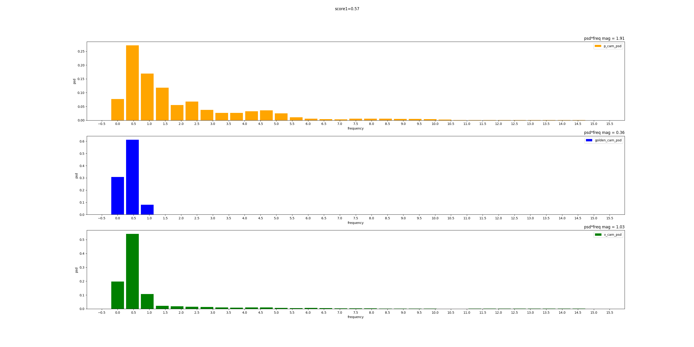

### Score 2: Jitter Compensation Analysis

**alpha_min_0.75_max_0.95_beta_1.00_gamma_0.95_inner_ratio_0.0_lookahead_0_crop_ratio_0.1**

`score2=0.42`

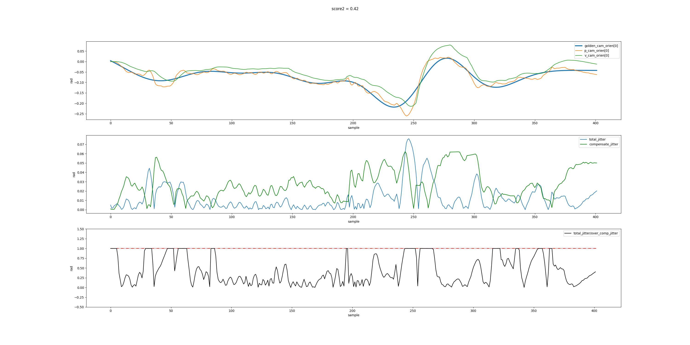

**alpha_min_0.75_max_0.95_beta_1.00_gamma_0.95_inner_ratio_0.0_lookahead_5_crop_ratio_0.1**

`score2=0.55`

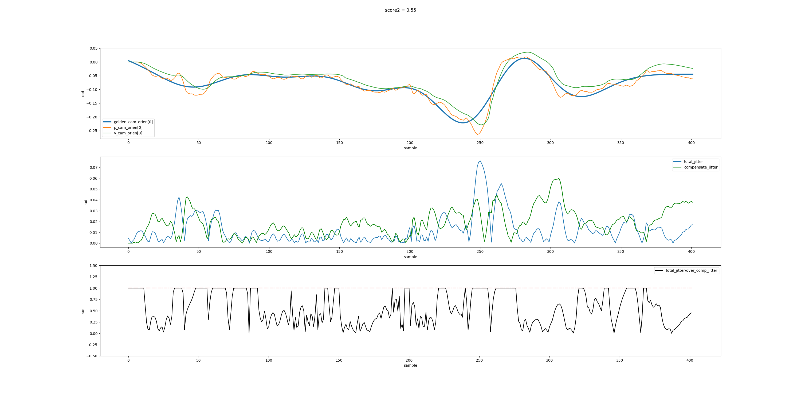

**alpha_min_0.75_max_0.95_beta_1.00_gamma_0.95_inner_ratio_0.0_lookahead_10_crop_ratio_0.1**

`score2=0.77`

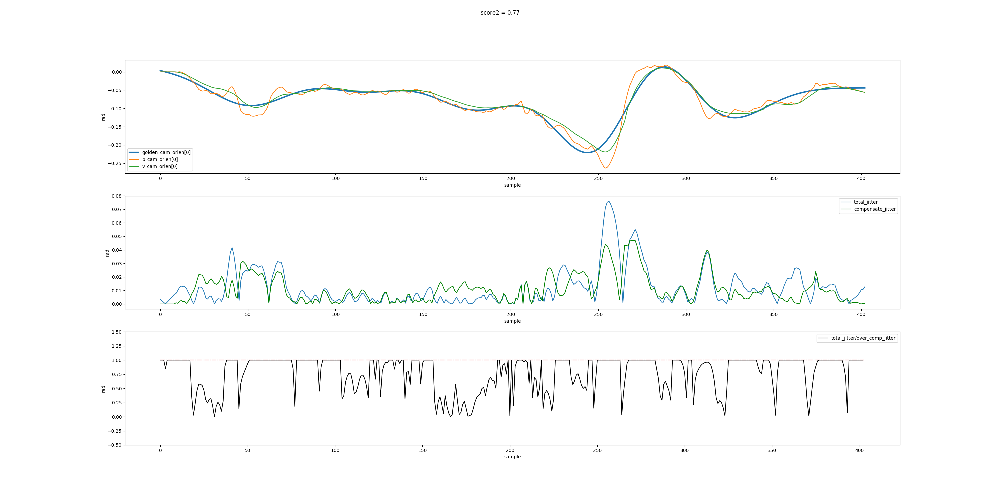

**alpha_min_0.75_max_0.95_beta_1.00_gamma_0.95_inner_ratio_0.0_lookahead_15_crop_ratio_0.1**

`score2=0.62`

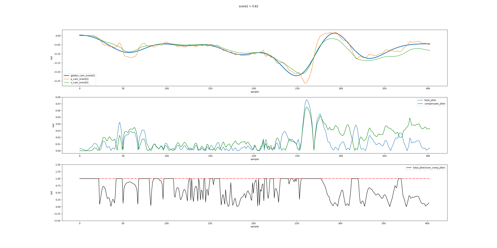

**alpha_min_0.75_max_0.95_beta_1.00_gamma_0.95_inner_ratio_0.0_lookahead_20_crop_ratio_0.1**

`score2=0.54`

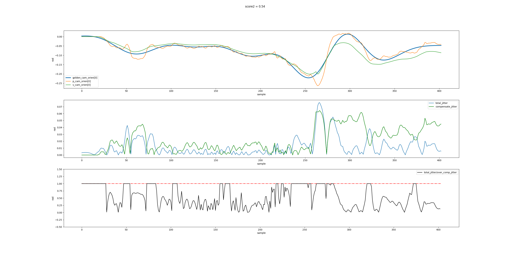