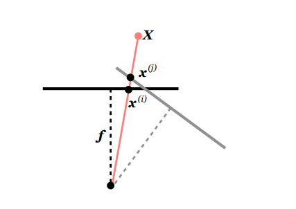
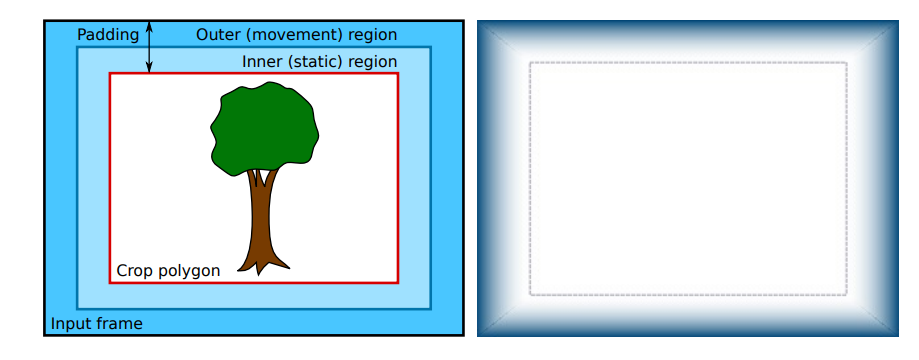
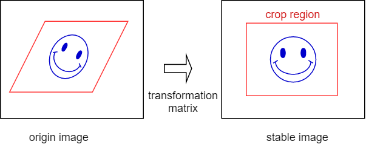
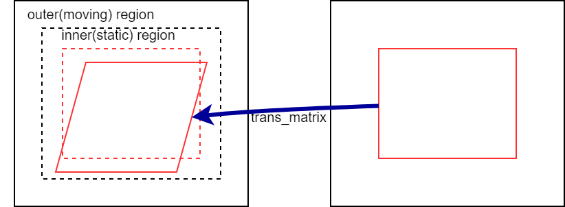
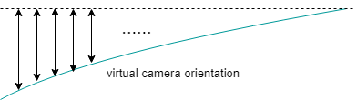
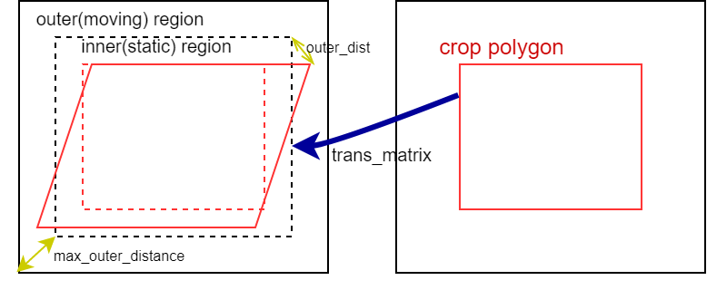
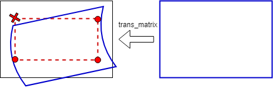
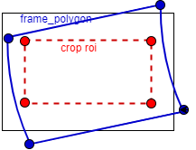
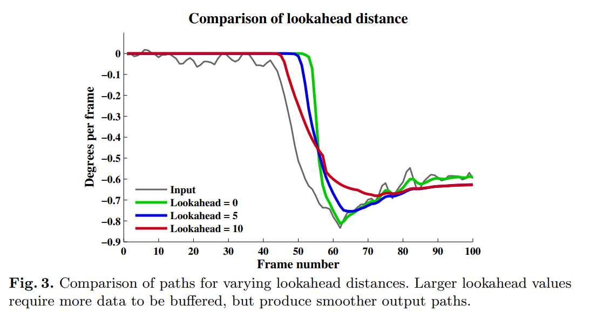

# Algorithm Memo: Non-Linear Filter for Video Stabilization

This memo is to describe the design of non-linear filter in video stabilization algorithm, the reference is from [A Non-Linear Filter for Gyroscope-Based Video Stabilization]( https://research.nvidia.com/publication/non-linear-filter-gyroscope-based-video-stabilization )

### Transformation from unstable to stable camera orientation:

For an object  X in world coordinate which project the coordinate to image with camera orientation 

 $trans\_matrix = cal\_trans\_matrix(p\_cam\_orien,v\_cam\_orien) $

$x_{stable} = x_{unstable}.trans\_matrix$

> $x_{unstable}$ is the coordinate of original image
>
> $x_{stable}$ is the coordinate of stable image
>
> $v\_cam\_orien$ is virtual camera orientation
>
> $p\_cam\_orien$ is physical camera orientation



**Definition**

- **camera orientation**:  a trajectory of a camera

  - **physical camera orientation**: $p[k]$

    a real, physical camera orientation
  
  - **virtual camera orientation**: $v[k]$
  
    a smoother physical camera orientation 
  
- **camera velocity**: rotation change of a camera

  - **physical camera velocity**: $p\Delta[k]$ 

    physical camera rotation change
  
  - **virtual camera velocity:** $v\Delta[k]$
  
    virtual camera rotation change

- **transformation matrix:** the transformation matrix is to project coordinate from physical camera to virtual camera coordinate.

**Equation**

- **physical camera orientation**

  $p[k]= Quaternion.integrate(p[k-1],angular\_velocity,\Delta t)$

- **physical camera velocity**

  $p\Delta[k-1] = p^*[k-1].p[k]\ ,p^*[k-1] \ is\  conjugate\  of\ p[k-1] $

- **virtual camera orientation**

  $v[k]=v[k-1].v\Delta[k-1]$

- **virtual camera velocity**

  $v\Delta[k]= slerp(p\Delta[k-1],v\Delta[k-1],\alpha)$

  $\alpha $ is low-pass filter coefficient
  
- **transformation matrix** 

  $trans\_matrix = KR_vR_p^{-1}K^{-1}$

  $R_v$ and $R_p$ are virtual and   physical orientation matrix respectively.

  $K$ is camera intrinsic matrix

### Non-linear filter Design 

==All concept in paper is to have a coefficient $\alpha$==

$\alpha$ differs by crop polygon location



- **Crop Polygon**

Crop polygon is computed from crop region of origin image to a stable image

```
crop polygon = crop_region*trans_matrix
```





- **inner region**: 
  
  
  
  

  

  to be a static region, which reduce the virtual camera velocity in this area
$$
virtual\_angle_i = d\times virtual\_angle_{i-1}, d\ is\ damping\ coefficient
$$




- **outer region:**

  ==paper method:==

  I don't like it :( ...

  

  

  $\alpha = (1-\omega^\beta)$

  $\omega = \frac{outer\_distance}{max\_outer\_distance}$

  

  ==refinement==

  - boundary condition

    if there are any coordinate of the crop region out of  full-frame polygon, it would be out of boundary. 

    

  The out-of-boundary condition occurs when any vertex of crop ROI  out of the frame polygon, so we adjust the low-pass filter smooth coefficient by the distance of frame_polygon and crop ROI. 

  the low pass filter coefficient $ \alpha$ is:

  $\omega = \frac{min\_vertices\_distance}{max\_distance}$

  for limit low-pass filter, I apply boundary for low-pass filter $\alpha$ in $[\alpha_{min},\alpha_{max}]$

  $\alpha\_ratio = \omega^\beta$

  $\alpha = \alpha\_ratio*\alpha_{max} + (1-\alpha\_ratio)*\alpha_{min}$

  and apply another lpf to low-pass filter coefficient $\alpha$ to avoid too many uncontinuous out-of boundary condition.

  $\alpha[k]  = 0.95*\alpha[k-1] + 0.05*\alpha[k]$

  

### Boundary Limitation

- **boundary control**

  In the out of the boundary condition, we have two criteria to converge physical and virtual camera orientation

  - no rolling shutter correction

    All compensation is eliminated includes rolling shutter correction, as the frame polygon hits the crop region. In the out-of-boundary condition,the most import thing is to converge the difference between physical and virtual camera trajectory. So we stop the rolling shutter correction in the out-of-boundary condition.

  - remain virtual camera velocity with physical camera velocity

    $pv\Delta[k-1]= p[k-1]^*.v[k-1]$
    
    $v[k]=p[k].pv\Delta[k-1]$


### Look-ahead Filter

The low-pass filter window size span by projecting the virtual camera orientation forward in time and comparing it to the actual orientation at =="future"== time.



#### Hypothesis:

==paper==

**forward filter**

$v\Delta(k)= slerp(p\Delta(k),v\Delta(k-1),\alpha)$

**look-ahead filter:**

Let a be the number $a$ frames to look ahead, the hypothesis: 

$v(k+a)= v(k-1).v\Delta(k)^{a+1}$

and $v\Delta(k)$ can be updated:

$v\Delta(k)= slerp(v\Delta(k+a),v\Delta(k),\gamma)$

==refinement==

**forward filter**

$v\Delta(k)= slerp(p\Delta(k),v\Delta(k-1),\alpha)$

**look-ahead filter:**

for i = a to 0

$v\Delta(k)= slerp(p\Delta(k)^i,v\Delta(k),\gamma)$


#### Data Structure

the data structure have to fit both forward filter and look-ahead filter, as look-ahead number $a$=0, which means forward filter. 

there are queues in the filter to buffer history data:

- p_cam_orien queue 

  physical camera orientation buffer, include knee points orientation of each frame.

- v_cam_orien queue

  virtual camera orientation buffer

- $ v\Delta $ queue

  virtual camera velocity buffer

- frame queue

  frame buffer

| Queue                     | 0    | 1    | 2    | 3    | 4    |
| ------------------------- | ---- | ---- | ---- | ---- | ---- |
| **p_cam_orien_buffer**    |      |      |      |      |      |
| **v_cam_orien_buffer**    |      |      |      |      |      |
| **v_cam_velocity_buffer** |      |      |      |      |      |
| **frame_buffer**          |      |      |      |      |      |

### Queue Handler

let set $a$ = 5, so each queue size would be 5

**Initialization:**

```python
# initialize buffer
v_cam_orien_buffer = deque(maxlen=a)
p_cam_orien_buffer = deque(maxlen=a)
v_cam_velocity_buffer =  deque(maxlen=a)
frame_buffer = deque(deque(maxlen=a))
# initialize camera orientation and velocity
prev_v_cam_orien = Quaternion()
prev_p_cam_orien = Quaternion()
prev_v_cam_velocity = Quaternion()
```

- ==i = 0==

  $p[0]= intergrate(p_{prev},\omega[0],\Delta t)$

  $p\Delta [0]= p[0].p^*_{prev}$

  $v\Delta [0]= slerp(p\Delta[0],v\Delta_{prev},alpha) $

  $v[0]= v_{prev}.v\Delta [0]$

  

  ​	push to buffer: 

  ​	$frame[0], p[0], v [0], v\Delta [0]$

  ​	$p_{prev}= p[0]$

  ​	$v_{prev}= v[0]$

  ​	$v\Delta_{prev}= v\Delta [0]$

  | Queue                     | 0              | 1    | 2    | 3    | 4    |
  | ------------------------- | -------------- | ---- | ---- | ---- | ---- |
  | **p_cam_orien_buffer**    | $p [0]$        |      |      |      |      |
  | **v_cam_orien_buffer**    | $v[0]$         |      |      |      |      |
  | **v_cam_velocity_buffer** | $v\Delta [0] $ |      |      |      |      |
  | **frame_buffer**          | frame[0]       |      |      |      |      |

- i = 1

- i = 2

- i = 3

  ...

- ==i = 4==

  $p[4]= intergrate(p_{prev},\omega[4],\Delta t)$

  $p\Delta [4]= p[4].p^*_{prev}$

  $v\Delta [4]= slerp(p\Delta[4],v\Delta_{prev},alpha) $

  $v[4]= v_{prev}.v\Delta [4]$

  push to buffer: 

  ​	$frame[4], v [4], v\Delta [4]$

  ​	$p_{prev}= p[4]$

  ​	$v_{prev}= v[4]$

  ​	$v\Delta_{prev}= v\Delta [4]$

  | Queue                     | 0              | 1              | 2              | 3              | 4              |
  | ------------------------- | -------------- | -------------- | -------------- | -------------- | -------------- |
  | **p_cam_orien_buffer**    | $p[0]$         | $p [1]$        | $p [2]$        | $p [3]$        | $p [4]$        |
  | **v_cam_orien_buffer**    | $v[0]$         | $v [1]$        | $v[2]$         | $v[3]$         | $v[4]$         |
  | **v_cam_velocity_buffer** | $v\Delta [0] $ | $v\Delta [1] $ | $v\Delta [2] $ | $v\Delta [3] $ | $v\Delta [4] $ |
  | **frame_buffer**          | frame[0]       | frame[1]       | frame[2]       | frame[3]       | frame[4]       |

- ==i = 5==

$p[5]= intergrate(p_{prev},\omega[5],\Delta t)$

$p\Delta [5]= p[5].p^*_{prev}$

$v\Delta [5]= slerp(p\Delta[5],v\Delta_{prev},\alpha) $

$v[5]= v_{prev}.v\Delta [5]$

 if (queue.size() >= a)

{

​	$v\Delta [0] = slerp(v\Delta[0],v\Delta[5],\gamma)$

​	$v[1]= v[0].v\Delta[0]$

​    trans_matrices[1] = cal_trans_matrices(v[1],p[1])

}

push to buffer: 

​	$frame[5], v [5], v\Delta [5]$

​	$p_{prev}= p[5]$

​	$v_{prev}= v[5]$

​	$v\Delta_{prev}= v\Delta [5]$

| Queue                     | 0              | 1            | 2              | 3              | 4              |
| ------------------------- | -------------- | ------------ | -------------- | -------------- | -------------- |
| **p_cam_orien_buffer**    | p[1]           | p [2]        | p [3]          | p [4]          | p [5]          |
| **v_cam_orien_buffer**    | v[1]           | v [2]        | v[3]           | v[4]           | v[5]           |
| **v_cam_velocity_buffer** | $v\Delta[1 ] $ | $v\Delta[2]$ | $v\Delta[3 ] $ | $v\Delta[4 ] $ | $v\Delta[5 ] $ |
| **frame_buffer**          | frame[1]       | frame[2]     | frame[3]       | frame[4]       | frame[5]       |

  

**Pseudo code:**

```python
# integrate physycal camera orientation 
p_cam_orien = integrate_p_cam_orien(prev_p_cam_orien,angular_vecloty, timestamp)
# calculate physical camera velocity
p_cam_velocity = p_cam_orien*prev_p_cam_orien.conjugate
# virtual camera velocity calculation in foward direction
current_v_cam_velocity= slerp(p_cam_velocity,prev_v_cam_velocity,alpha)

# virtual camera velocity calculation in look-ahead direction
if len(v_cam_velocity_buffer)>= a:
    
    foward_v_cam_velocity = v_cam_velocity_buffer[0]
	foward_v_cam_velocity = slerp(current_v_cam_velocity,foward_v_cam_velocity,gamma)

	# virtual camera orientation integration
	v_cam_orien_buffer[1] = v_cam_orien_buffer[0]* forward_v_cam_velocity
	trans_matrices = cal_trans_matrices(v_cam_orien_buffer[1],p_cam_orien_buffer[1])
    
# push orientation and velocity to buffer
p_cam_orien_buffer.push_back(p_cam_orien)
v_cam_orien_buffer.push_back(v_cam_orien)
v_cam_velocity_buffer.push_back(current_v_cam_velocity)

# store current to previous orientation and velocity
prev_v_cam_orien = v_cam_orien
prev_p_cam_orien = p_cam_orien
prev_v_cam_velocity = current_v_cam_velocity

```

### Transformation Matrix

$trans\_matrix = KR_vR_p^{-1}K^{-1}$

to get the virtual camera coordinate, we have to inverse physical camera coordinate then rotate with virtual camera.

$x_v = x_p . p\_cam\_orien^{-1}.v\_cam\_orien$

so that 

$R_vR_p^{-1}= p\_cam\_orien^{-1}.v\_cam\_orien$

---

### Rolling Shutter Correction

#### Timing of inter-frame and intra-frame duration

**inter-frame duration**

```
inter-frame_start_ts = 
vsync_timestamp - vsync_duration + top_blanking x dt - prev_exptime*0.5

inter-frame_end_ts = 
vsync_timestamp + top_blanking x dt - exptime*0.5
```

**intra-frame duration**

```
intra-frame_start_ts = vsync_timestamp + top_blanking x dt - exptime*0.5

intra-frame_end_ts = vsync_timestamp + (top_blanking + image_height) x dt - exptime*0.5
```


