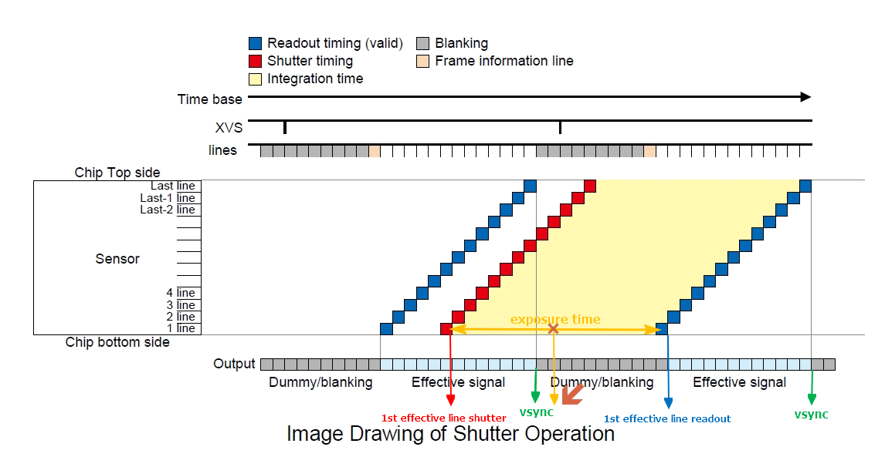
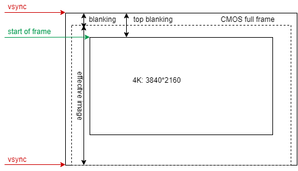

# Signal Timing in EIS

### Timing between vsync  and exposure time

```
1st_effective_line_timestamp = vsync_timestamp + blanking x dt - exptime*0.5
```



### Timing of Start of Frame 

```
start_of_frame_timestamp = vsync_timestamp + top_blanking x dt - exptime*0.5
end_of_frame_timestamp = vsync_timestamp + (top_blanking + image_height) x dt - exptime*0.5
```



start of frame differs from aspect ratio of video resolution


### Timing between inter-frame motion and intra-frame motion

**inter-frame duration**

```
inter-frame_start_ts = 
vsync_timestamp - vsync_duration + top_blanking x dt - prev_exptime*0.5

inter-frame_end_ts = 
vsync_timestamp + top_blanking x dt - exptime*0.5
```

**intra-frame duration**

```
intra-frame_start_ts = vsync_timestamp + top_blanking x dt - exptime*0.5

intra-frame_end_ts = vsync_timestamp + (top_blanking + image_height) x dt - exptime*0.5
```


