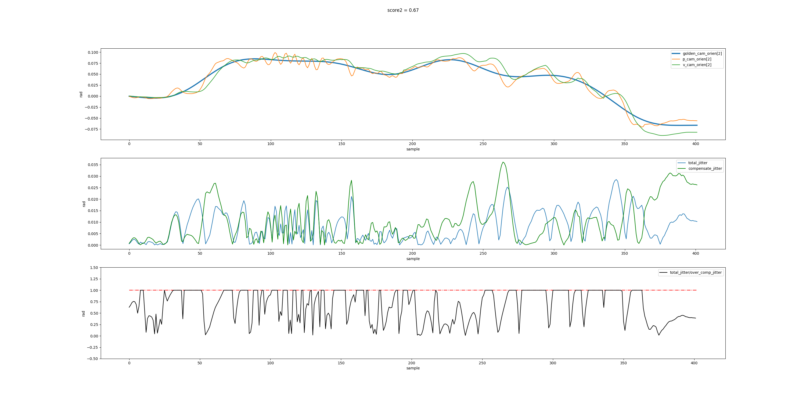

# Evaluation of Filter in Video Stabilization

This function is to evaluate the filter design of video stabilization algorithm.
There are two features to evluate the performace of video stabilization filter, their results are:

1. score 1: High Frequency Analysis
2. score 2: Jitter Compensation Analysis

the final score fused by score 1 and score 2:

`score = 0.6*score1 + 0.4score2`

**usage:**
`python3 run_evaluation.py log_dir`

the result would be saved in log_dir/filter_evaluation.csv

|            | score1 | score2 | score |
| ---------- | ------ | ------ | ----- |
| cam_axis_0 | 0.51   | 0.42   | 0.47  |
| cam_axis_1 | 0.52   | 0.54   | 0.53  |
| cam_axis_2 | 0.61   | 0.67   | 0.64  |
| avg_score  | 0.55   |     

and figures saved as png to analysis the score1 and score2

**score1**

psd_analysis_axis_0.png

psd_analysis_axis_1.png

psd_analysis_axis_2.png

**score2**

jitter_analysis_axis_0.png

jitter_analysis_axis_1.png

jitter_analysis_axis_2.png

