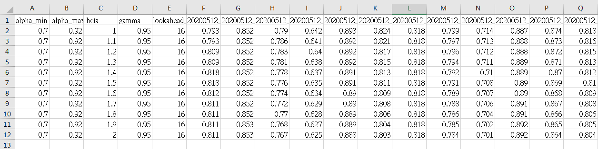

# Filter Optimization

This is to regress the optimization paramters in non-linear filter of video stabilization.

we set the range of parameters in config/filter_range_config.json

```
{
    "alpha_min_range": [0.7,0.7, 0.01],
    "alpha_max_range": [0.95,0.96,0.01],
    "beta_range": [1.0,1.0,0.1],
    "gamma_range": [0.95,0.95,0.01],
    "lookahead_no_range": [10,10,1]

  }

```

the value in array[0] means minimum value
the value in array[1] means maximum value
the value in array[2] means interval the the parameters from minimum to maximum value.


**usage**

`python run_filter_batch_param.py dataset_dir log_prefix`

for exampe, 
`python run_filter_batch_param.py /home/lesia/dataset 20200512_log`

the resport will store at dataset_dir in csv file, like "dataset_20200512_alpha_min_0.70_0.70_alpha_max_0.92_0.92_beta_1.00_2.00_gamma_0.95_0.95_lookahead_16_16_filter_score.csv", the file naming is by the configuration file.


