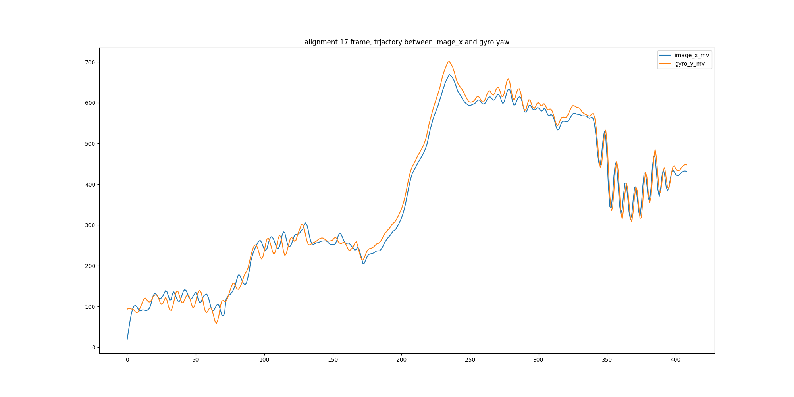
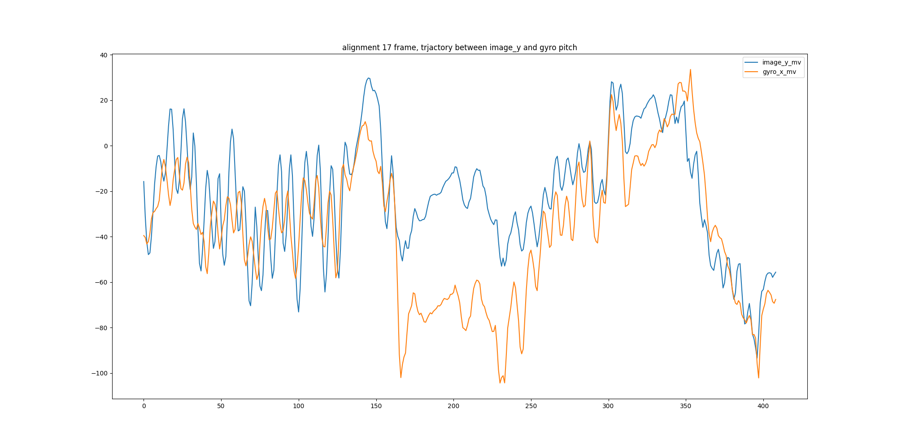
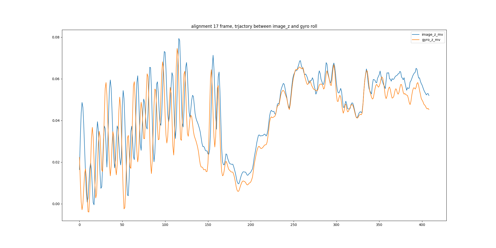

# Gyro-Video Time Alignment


This function is to alignment the time between gyro samples and video. 
In our application, we have video with vido meta data

the video meta data is as:

```
frame_ts0,exposore_time0
frame_ts1,exposore_time1
frame_ts2,exposore_time2
...
```
and gyro samples is:

```
ts0, gx0, gy0, gz0
ts1, gx1, gy1, gz1
ts2, gx2, gy2, gz2
...
```
However, we don't know the video start from which frame in the meta data,

so we use motion from image sequences(see the utility/motion_estimation), and align the motion from image and gyro

**usage**

##### Video Motion Estimation

before align motion between video and gyro, video motion have to be calculated at first:

`python run_video_motion_estimation log_dir`

it calculate the video motion from log_dir/xxx.mp4, and the motion vector will be in log_dir/motion_vector/motion_vector.log

#### Motion Alignment

`python run_motion_alignment.py log_dir`

the log directories would be like:

```
├── cs.log # video meta data
├── imu.log  # gyro samples
├── motion_vector
│   └── motion_vector.log # motion vector calculated by utililty/motion_estimation
└── video_20200414_171527.mp4
```

configuration:
you can adjust configuration from param.py

```
fps = 30 # video frame per sec
focal_length = 2000 #focal length
time_scale = 10**7 # timestamp unit

```


then the result would be in log_dir/trajectory_alignment/align_idx.txt



