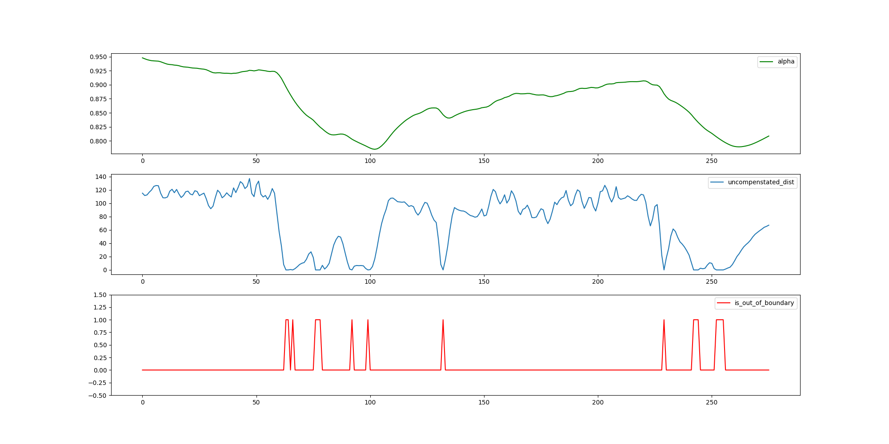
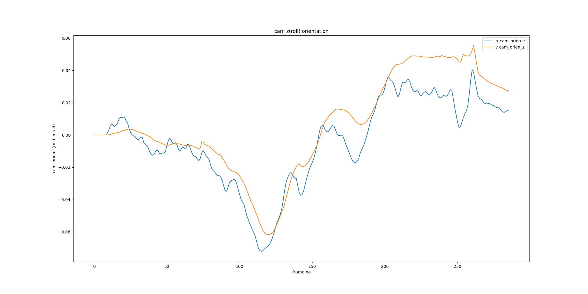

# Vid_Stab  Analysis 

This function is to analysis vid_stab result, which use the log of vid_stab simulation result
to analyze.

After running the vid_stab program, there would be _vid_stab.log_ in the dataset directory,

```
top blanking = 178
frame_rate = 30.000000
frame_duration = 0.033333
line_duration = 0.000023
rs_time = 0.025067
================================
focal length = 1418.218085
================================
out_dist = 135.000000
load cmos log....
load gyro log....
cmos signal frame_count = 1
cmos signal frame_count = 2
=============================================================
frame_count = 0
start of frame: vs = 4529436513, exp = 100000
cmos signal frame_count = 3
=============================================================
frame_count = 1
start of frame: vs = 4529769760, exp = 100000
prev_frame_ts = 452.942776, current_frame_ts = 452.976109, dt = 0.033333
first_line_ts = 452.976109, last_line_ts = 453.001176
now is outer moving region
v_cam_orientation x/y/z: 0.000000, 0.000000, 0.000000
p_cam_orientation x/y/z: 0.000000, 0.000000, 0.000000
is_out_of_boundary = 0
uncompensated_dist = 0.000000
alpha = 0.000000
cmos signal frame_count = 4
=============================================================
frame_count = 2
start of frame: vs = 4530103009, exp = 100000
prev_frame_ts = 452.976109, current_frame_ts = 453.009434, dt = 0.033325
first_line_ts = 453.009434, last_line_ts = 453.034501
now is outer moving region
v_cam_orientation x/y/z: 0.000000, 0.000000, 0.000000
p_cam_orientation x/y/z: 0.000000, 0.000000, 0.000000
is_out_of_boundary = 0
uncompensated_dist = 0.000000
alpha = 0.000000
cmos signal frame_count = 5

```
**usage**

`./run_analysis.sh log_dir`

and then the script grep the data from log_dir/vid_stab.log

and plot figure to analyze the result

**boundary control analysis:**



**camera axis-x orientation**


**camera axis-y orientation**


**camera axis-z orientation**



**path analysis**


